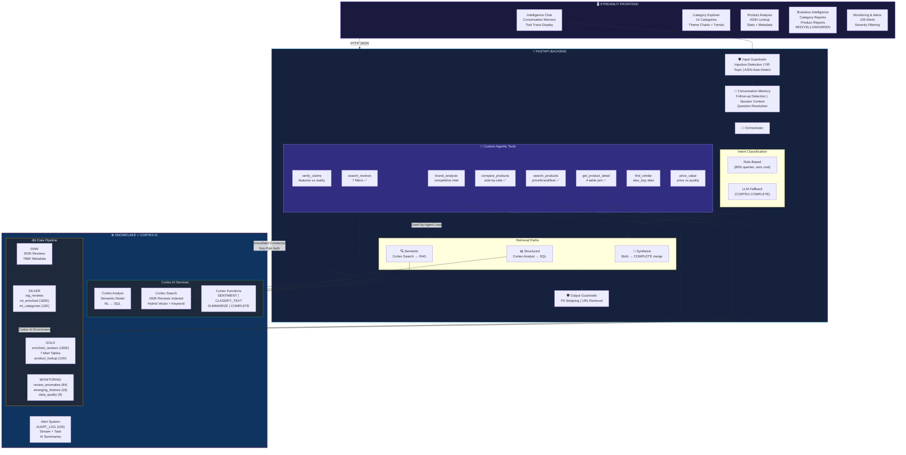
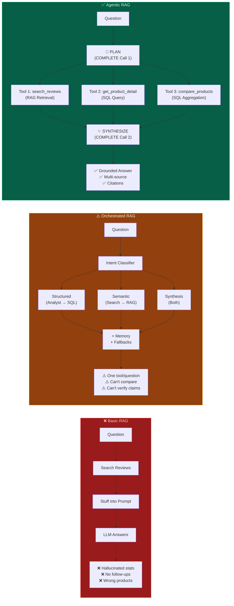
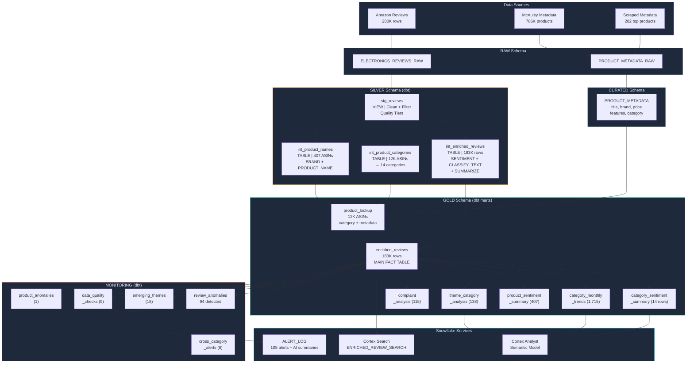
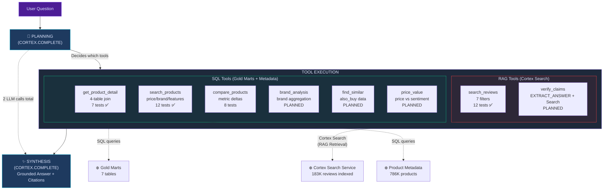
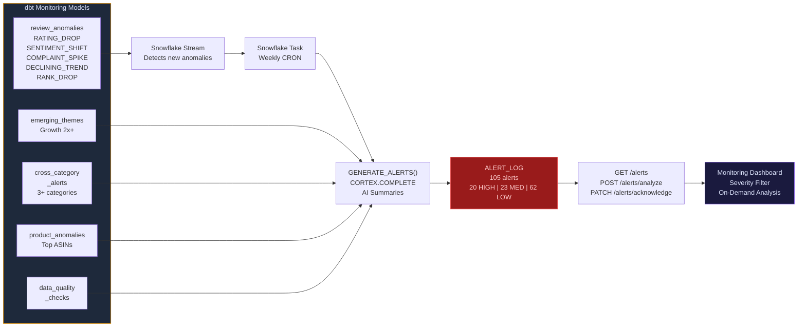
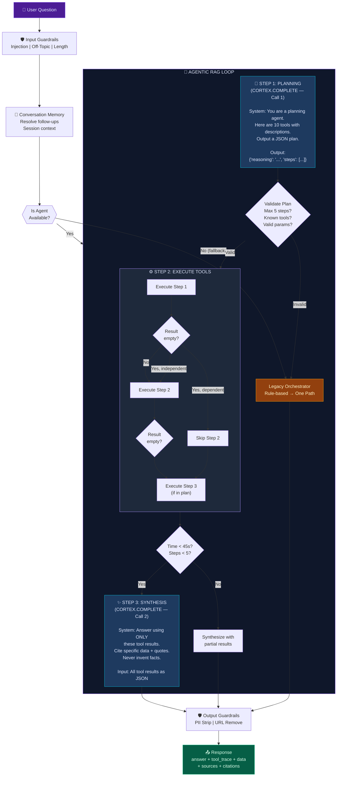
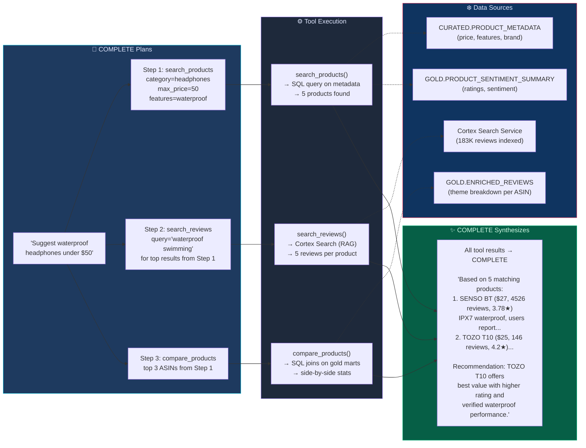
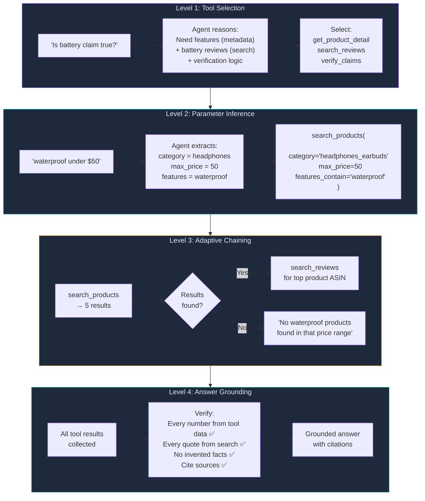
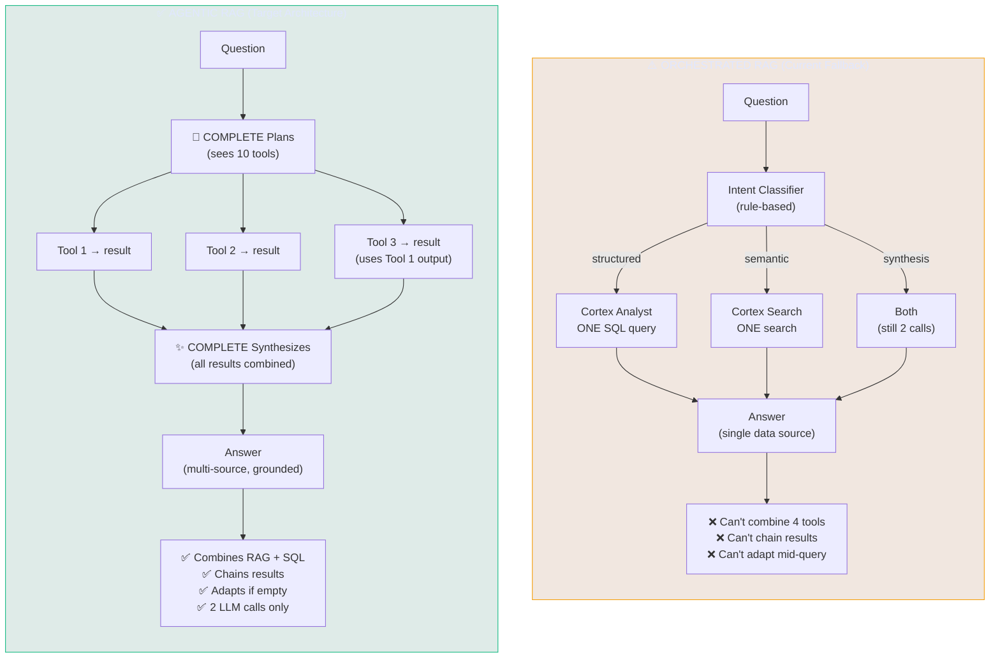

# ReviewSense AI — Mermaid Diagrams

Copy any of these into https://mermaid.live to generate images (export as PNG/SVG).

## 1. System Architecture (Full)



## 2. RAG Evolution (3 Approaches)



## 3. Data Flow Pipeline



## 4. Agentic Tool Architecture



## 5. Monitoring & Alert Flow



## 6. Agentic RAG — Detailed Flow



## 7. Agentic RAG — Tool Execution Detail



## 8. Agentic RAG — Intelligence Levels



## 9. Agentic vs Orchestrated — Side by Side



## How to Generate Images

1. Go to **https://mermaid.live**
2. Paste any diagram code above
3. Click **Actions → Export PNG** (or SVG for high quality)
4. For dark theme: toggle the theme in mermaid.live settings

Or use VS Code extension: **"Mermaid Markdown Syntax Highlighting"** + **"Markdown Preview Mermaid Support"** to preview directly in VS Code.

Or generate via CLI:
```bash
npm install -g @mermaid-js/mermaid-cli
mmdc -i architecture_mermaid.md -o architecture.png -t dark
```
